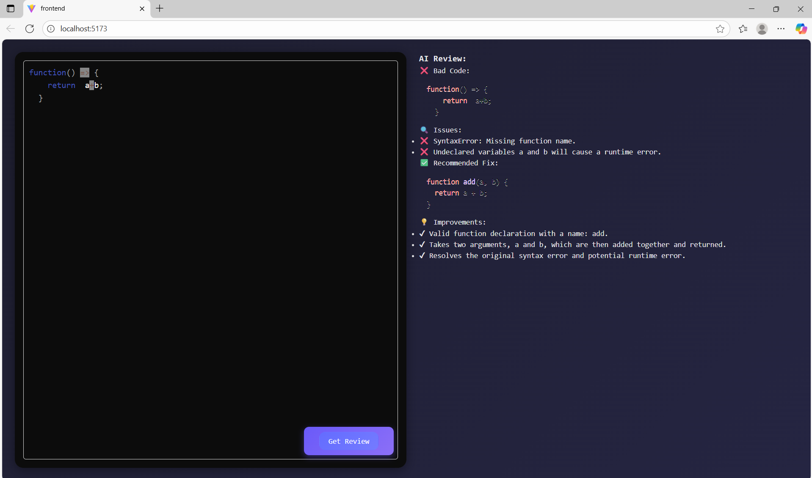
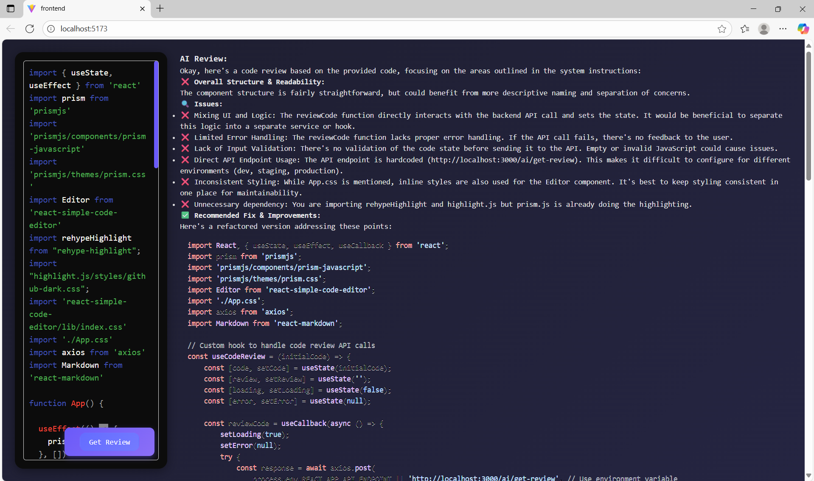

#  AI-Powered Code Review Platform  

##  Overview  
This project is a **full-stack web application** that automates the process of reviewing source code using **AI-powered analysis**.  
It provides developers with instant feedback on code quality, best practices, and potential issues, helping improve productivity and maintainability.  

---

##  Tech Stack  
- **Frontend:** React, Vite, CSS  
- **Backend:** Node.js, Express  
- **Linting & Standards:** ESLint  
- **AI Integration:** Custom AI service (via `ai.controller.js` & `ai.service.js`)  
- **Other Tools:** Git, npm  

---
###  AI Review Interface  

###  Code Editor & Output  

##  Features  
-  **Automated AI Code Reviews** – Get instant suggestions on your code.  
-  **Interactive UI** – Built with React + Vite for a fast and responsive experience.  
-  **Modular Backend** – Controllers, routes, and services for scalable APIs.  
-  **Code Quality Assurance** – ESLint integration for cleaner and consistent code.  

---
